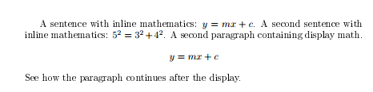
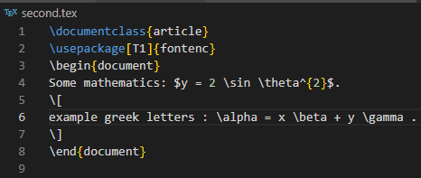
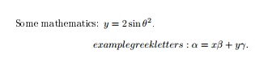
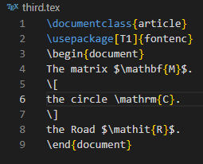
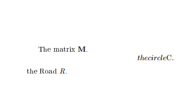
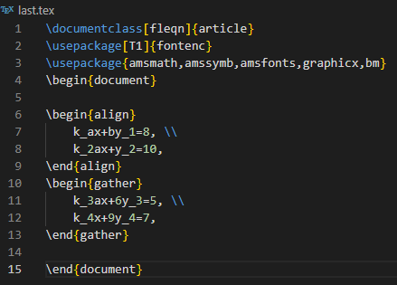
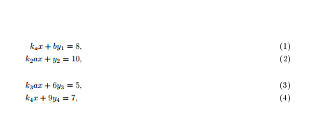
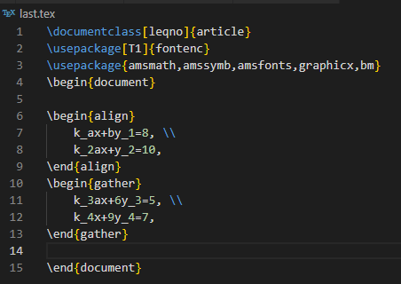
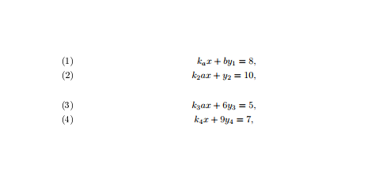

---
## Front matter
lang: ru-RU
title: Computer Skills for Scientific Writing
author: Кодже Лемонго Арман
institute: Российский Университет Дружбы Народов
date: 11 октрябь, 2025, Москва, Россия

## Formatting
mainfont: PT Serif
romanfont: PT Serif
sansfont: PT Sans
monofont: PT Mono
toc: false
slide_level: 2
theme: metropolis
header-includes: 
 - \metroset{progressbar=frametitle,sectionpage=progressbar,numbering=fraction}
 - '\makeatletter'
 - '\beamer@ignorenonframefalse'
 - '\makeatother'
aspectratio: 43
section-titles: true

---

# Цели и задачи

## Цель лабораторной работы

This work presents LaTeX’s math mode and how we can type inline and display formulas, the extensions provided by the amsmath package, and how to change fonts in math.

# Выполнение лабораторной работы

## inline and display math mode

inline math mode is marked using a pair of dollar symbols ($...$). It is also possible to use the notation \( ... \), You can use exactly the same commands for display math mode as for inline work.
{#fig 1 :inline and display math mode}
{#fig 2 :compilations results inline and display math mode}

## add Greek letters, both lower- and uppercase

There are a lot of specialist math mode commands. Some of them are quite easy, for example \sin, \alpha, \beta, \gamma ... and \log for sine and logarithm or \theta for the Greek letter.
{#fig 3 : Greek letters}
{#fig 4 : compilations results Greek letters}  

## font changing commands
They are therefore often written explicitly. There are a set of commands you need here:
• \mathrm: roman (upright)
• \mathit: italic spaced as ‘text’
• \mathbf: boldface
• \mathsf: sans serif
• \mathtt: monospaced (typewriter)
• \mathbb: double-struck (blackboard bold) (provided by the amsfonts package)

For examples : 
{#fig 5 : Fonts in math mode}
{#fig 6 : ompilations results Fonts in math mode}

## document class option
fleqn: Makes display equations flush left instead of centered.
Example: \documentclass[fleqn]{article}
{#fig 9 :fleqn flush left equation }
{#fig 10 : compilations results fleqn flush left equation}

leqno: Places equation numbers on the left side of the equation
Example: \documentclass[leqno]{article}
{#fig 11:leqno flush left equation}
{#fig 12 : compilation results with leqno left equation numbers}

# Выводы
в конце нашего лабораторная работа, я освоил как работает математический режим LaTeX для встроенных и отображаемых формул, греческих букв, стилей шрифтов и параметров макета уравнений.  
