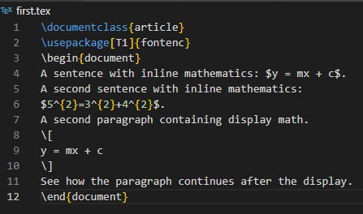
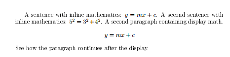
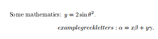
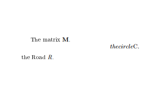
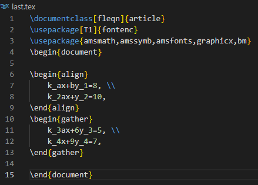
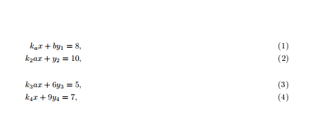
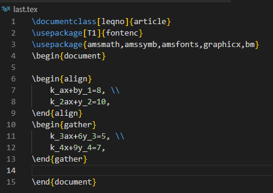
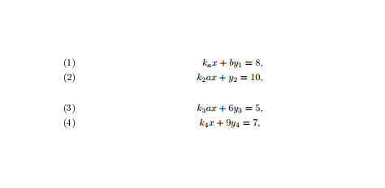

---
# Front matter
title: "Отчёт по лабораторной работе №3"
subtitle: "Computer Skills for Scientific Writing"
author: "Кодже Лемонго Арман"

# Generic otions
lang: ru-RU
toc-title: "Содержание"

# Bibliography
bibliography: bib/cite.bib
csl: pandoc/csl/gost-r-7-0-5-2008-numeric.csl

# Pdf output format
toc: true # Table of contents
toc_depth: 2
lof: true # List of figures
fontsize: 12pt
linestretch: 1.5
papersize: a4
documentclass: scrreprt
## I18n
polyglossia-lang:
  name: russian
  options:
	- spelling=modern
	- babelshorthands=true
polyglossia-otherlangs:
  name: english
### Fonts
mainfont: PT Serif
romanfont: PT Serif
sansfont: PT Sans
monofont: PT Mono
mainfontoptions: Ligatures=TeX
romanfontoptions: Ligatures=TeX
sansfontoptions: Ligatures=TeX,Scale=MatchLowercase
monofontoptions: Scale=MatchLowercase,Scale=0.9
## Biblatex
biblatex: true
biblio-style: "gost-numeric"
biblatexoptions:
  - parentracker=true
  - backend=biber
  - hyperref=auto
  - language=auto
  - autolang=other*
  - citestyle=gost-numeric
## Misc options
indent: true
header-includes:
  - \linepenalty=10 # the penalty added to the badness of each line within a paragraph (no associated penalty node) Increasing the value makes tex try to have fewer lines in the paragraph.
  - \interlinepenalty=0 # value of the penalty (node) added after each line of a paragraph.
  - \hyphenpenalty=50 # the penalty for line breaking at an automatically inserted hyphen
  - \exhyphenpenalty=50 # the penalty for line breaking at an explicit hyphen
  - \binoppenalty=700 # the penalty for breaking a line at a binary operator
  - \relpenalty=500 # the penalty for breaking a line at a relation
  - \clubpenalty=150 # extra penalty for breaking after first line of a paragraph
  - \widowpenalty=150 # extra penalty for breaking before last line of a paragraph
  - \displaywidowpenalty=50 # extra penalty for breaking before last line before a display math
  - \brokenpenalty=100 # extra penalty for page breaking after a hyphenated line
  - \predisplaypenalty=10000 # penalty for breaking before a display
  - \postdisplaypenalty=0 # penalty for breaking after a display
  - \floatingpenalty = 20000 # penalty for splitting an insertion (can only be split footnote in standard LaTeX)
  - \raggedbottom # or \flushbottom
  - \usepackage{float} # keep figures where there are in the text
  - \floatplacement{figure}{H} # keep figures where there are in the text
---

# Цель работы

This work presents LaTeX’s math mode and how we can type inline and display formulas, the extensions provided by the amsmath package, and how to change fonts in math.

# Exercises
1. Try out some basic math mode work: take the examples and switch between inline and display math modes. Can you see what effect this has.
2. Try adding other Greek letters, both lower- and uppercase. You should be able to guess the names.
3. Experiment with the font changing commands: what happens when you try to nest them?
4. Displayed math is centered by default; try adding the document class option [fleqn] (flush left equation) option to some of the above examples to see a different layout. Similarly equation numbers are usually on the right. Experiment with adding the [leqno] (left equation numbers) document class option.

# Выполнение работы

1. Try out some basic math mode work: take the examples and switch between inline and display math modes. Can you see what effect this has.
  
inline math mode is marked using a pair of dollar symbols ($...$). It is also possible to use the notation \( ... \). Simple expressions are entered without any special markup, and you’ll see that the math is spaced out nicely and has letters in italic.
You can use exactly the same commands for display math mode as for inline work.
You can use exactly the same commands for display math mode as for inline work. Display math mode is set centered by default and is meant for larger equations that are ‘part of a paragraph’. Note that display math environments do not allow a paragraph to end within the mathematics, so you may not have blank lines within the source of the display.
{#fig 1 :inline and display math mode}
{#fig 2 :compilations results inline and display math mode}

2. Try adding other Greek letters, both lower- and uppercase. You should be able to guess the names.
There are a lot of specialist math mode commands. Some of them are quite easy, for example \sin, \alpha, \beta, \gamma ... and \log for sine and logarithm or \theta for the Greek letter.
{#fig 3 : Greek letters}
{#fig 4 : compilations results Greek letters}

3. Experiment with the font changing commands: what happens when you try to nest them?
Unlike normal text, font changes in math mode often convey very specific meaning. 
They are therefore often written explicitly. There are a set of commands you need here:
• \mathrm: roman (upright)
• \mathit: italic spaced as ‘text’
• \mathbf: boldface
• \mathsf: sans serif
• \mathtt: monospaced (typewriter)
• \mathbb: double-struck (blackboard bold) (provided by the amsfonts package)

For examples : 
{#fig 5 : Fonts in math mode}
{#fig 6 : ompilations results Fonts in math mode}

4. Displayed math is centered by default; try adding the document class option [fleqn] (flush left equation) option to some of the above examples to see a different layout. 
Similarly equation numbers are usually on the right. Experiment with adding the [leqno] (left equation numbers) document class option.
{#fig 7 : class article }
{#fig 8 : compilations results class article}

fleqn: Makes display equations flush left instead of centered.
Example: \documentclass[fleqn]{article}
{#fig 9 :fleqn flush left equation }
{#fig 10 : compilations results fleqn flush left equation}

leqno: Places equation numbers on the left side of the equation
Example: \documentclass[leqno]{article}
{#fig 11:leqno flush left equation}
{#fig 12 : compilation results with leqno left equation numbers}

# Выводы

в конце нашего лабораторная работа, я освоил как работает математический режим LaTeX для встроенных и отображаемых формул, греческих букв, стилей шрифтов и параметров макета уравнений.     

# Список литературы{.unnumbered}

1. [latex](https://www.latex-project.org/get/)
