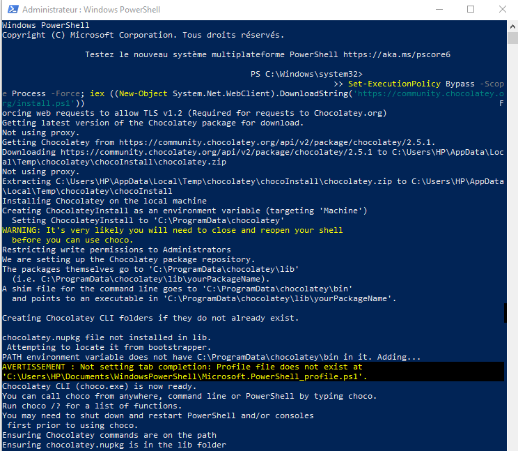

---
## Front matter
lang: ru-RU
title: Computer Skills for Scientific Writing
author: Кодже Лемонго Арман
institute: Российский Университет Дружбы Народов
date: 25 сентября, 2025, Москва, Россия

## Formatting
mainfont: PT Serif
romanfont: PT Serif
sansfont: PT Sans
monofont: PT Mono
toc: false
slide_level: 2
theme: metropolis
header-includes: 
 - \metroset{progressbar=frametitle,sectionpage=progressbar,numbering=fraction}
 - '\makeatletter'
 - '\beamer@ignorenonframefalse'
 - '\makeatother'
aspectratio: 43
section-titles: true

---

# Цели и задачи

## Цель лабораторной работы

Установить актуальную версию дистрибутива TeXLive

# Выполнение лабораторной работы

Произвел установку дистрибутива TeXLive на операционной системе Windows с помощью установщика choco. для этого нам сначала нужно установить choco (см. рис. [-@fig:001], [-@fig:001] ).
{#fig:001}

с помощью команды choco install texlive, мы будем установить texlive.
(см. рис. [-@fig:002], [-@fig:002] ).
(см. рис. [-@fig:003], [-@fig:003] ).
```
choco install texlive
```

{#fig:002}

{#fig:003}

# Выводы

## Результаты выполнения лабораторной работы

в конце нашего лабораторная работа, я установил актуальную версию дистрибутив TeXLive