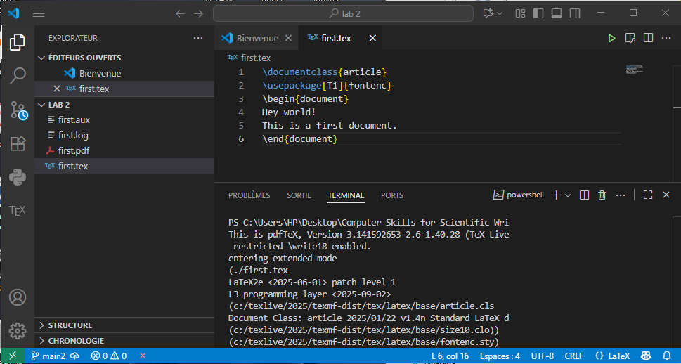
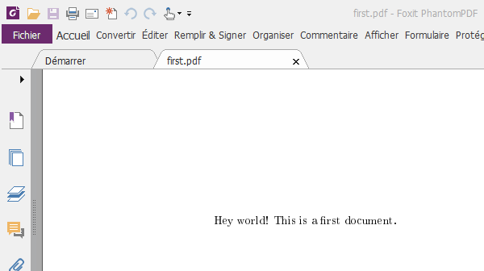
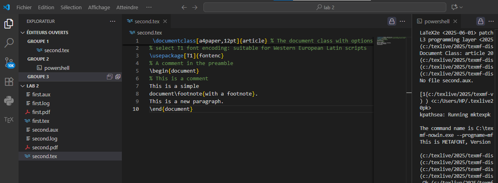
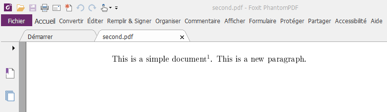
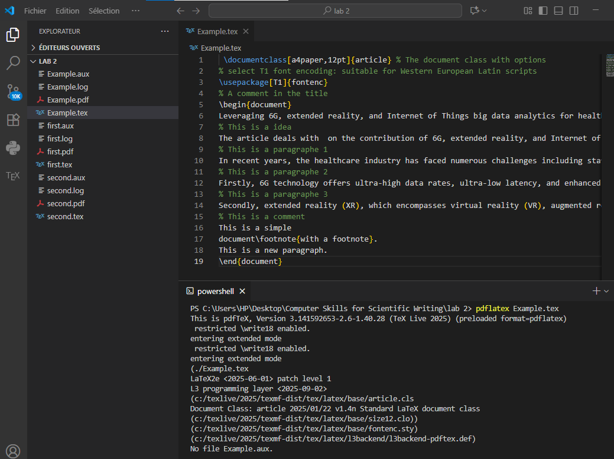
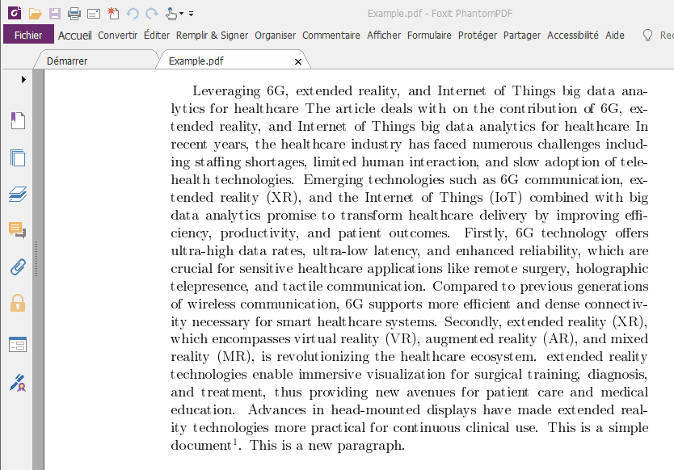

---
## Front matter
lang: ru-RU
title: Computer Skills for Scientific Writing
author: Кодже Лемонго Арман
institute: Российский Университет Дружбы Народов
date: 25 сентября, 2025, Москва, Россия

## Formatting
mainfont: PT Serif
romanfont: PT Serif
sansfont: PT Sans
monofont: PT Mono
toc: false
slide_level: 2
theme: metropolis
header-includes: 
 - \metroset{progressbar=frametitle,sectionpage=progressbar,numbering=fraction}
 - '\makeatletter'
 - '\beamer@ignorenonframefalse'
 - '\makeatother'
aspectratio: 43
section-titles: true

---

# Цели и задачи

## Цель лабораторной работы

Целью данной является Написать и скомпилировать первые документы с помоью LaTex  [@book]

# Выполнение лабораторной работы

## Теоретические сведения

В этом уроке показана базовая структура документа LaTeX и то, как преобразовать его
в PDF-файл, а также основные специальные символы, используемые для управления LaTeX.
Ваш первый документ на LaTeX будет очень простым: идея в том, чтобы показать вам, как
выглядит документ и как правильно его набирать.
Если вы используете локальную установку LaTeX, создайте в своем редакторе новый файл с именем 

## Содержание и компиляция простейшего документа LaTex 1

Создал документ first.tex и вставил код для разметки документа: открытие документа, текст и закрытие документа. Скомпилировал файл с помощью команды ```pdflatex tex``` и посмотрел результат с помощью средства просмотра документов (см. рис. [-@fig:001]) (см. рис. [-@fig:011]).
{#fig:001}
{#fig:011}     

## Содержание и компиляция с помощью программы редактора LaTex документы

Создал документ second.tex и вставил код . Скомпилировал файл с помощью команды ```pdflatex tex``` и посмотрел результат с помощью средства просмотра документов (см. рис. [-@fig:002]) (см. рис. [-@fig:022]).

{#fig:002}
{#fig:022}

Создал документ Example.tex и вставил код. Скомпилировал файл с помощью VS CODE и посмотрел результат с помощью средства просмотра документов (см. рис. [-@fig:003]) (см. рис. [-@fig:033]).

{#fig:003}
{#fig:033}      


# Выводы
в конце нашего лабораторная работа, я освоил работу с абзацами, отступами, пробеелами и специальными символами Latex.
