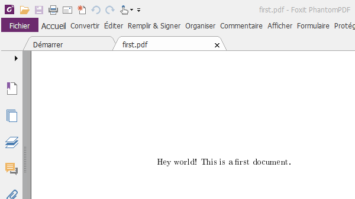
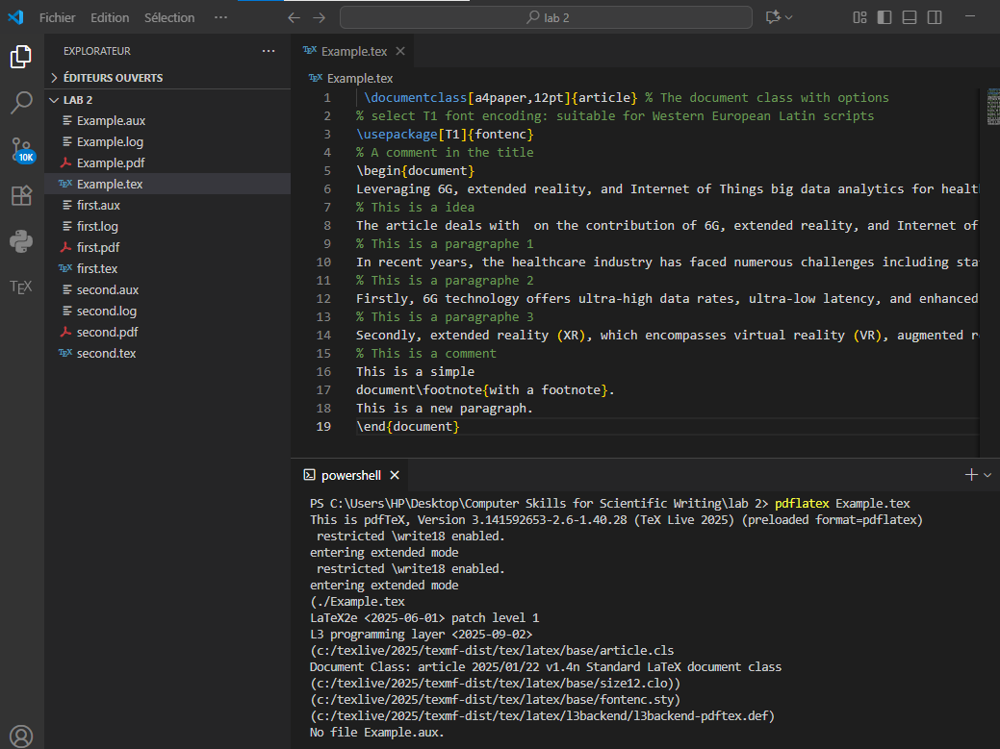

---
# Front matter
title: "Отчёт по лабораторной работе №2"
subtitle: "Computer Skills for Scientific Writing"
author: "Кодже Лемонго Арман"

# Generic otions
lang: ru-RU
toc-title: "Содержание"

# Bibliography
bibliography: bib/cite.bib
csl: pandoc/csl/gost-r-7-0-5-2008-numeric.csl

# Pdf output format
toc: true # Table of contents
toc_depth: 2
lof: true # List of figures
fontsize: 12pt
linestretch: 1.5
papersize: a4
documentclass: scrreprt
## I18n
polyglossia-lang:
  name: russian
  options:
	- spelling=modern
	- babelshorthands=true
polyglossia-otherlangs:
  name: english
### Fonts
mainfont: PT Serif
romanfont: PT Serif
sansfont: PT Sans
monofont: PT Mono
mainfontoptions: Ligatures=TeX
romanfontoptions: Ligatures=TeX
sansfontoptions: Ligatures=TeX,Scale=MatchLowercase
monofontoptions: Scale=MatchLowercase,Scale=0.9
## Biblatex
biblatex: true
biblio-style: "gost-numeric"
biblatexoptions:
  - parentracker=true
  - backend=biber
  - hyperref=auto
  - language=auto
  - autolang=other*
  - citestyle=gost-numeric
## Misc options
indent: true
header-includes:
  - \linepenalty=10 # the penalty added to the badness of each line within a paragraph (no associated penalty node) Increasing the value makes tex try to have fewer lines in the paragraph.
  - \interlinepenalty=0 # value of the penalty (node) added after each line of a paragraph.
  - \hyphenpenalty=50 # the penalty for line breaking at an automatically inserted hyphen
  - \exhyphenpenalty=50 # the penalty for line breaking at an explicit hyphen
  - \binoppenalty=700 # the penalty for breaking a line at a binary operator
  - \relpenalty=500 # the penalty for breaking a line at a relation
  - \clubpenalty=150 # extra penalty for breaking after first line of a paragraph
  - \widowpenalty=150 # extra penalty for breaking before last line of a paragraph
  - \displaywidowpenalty=50 # extra penalty for breaking before last line before a display math
  - \brokenpenalty=100 # extra penalty for page breaking after a hyphenated line
  - \predisplaypenalty=10000 # penalty for breaking before a display
  - \postdisplaypenalty=0 # penalty for breaking after a display
  - \floatingpenalty = 20000 # penalty for splitting an insertion (can only be split footnote in standard LaTeX)
  - \raggedbottom # or \flushbottom
  - \usepackage{float} # keep figures where there are in the text
  - \floatplacement{figure}{H} # keep figures where there are in the text
---

# Цель работы

Целью данной является Написать и скомпилировать первые документы с помоью LaTex  [@book]. 

# Теоретические сведения

В этом уроке показана базовая структура документа LaTeX и то, как преобразовать его
в PDF-файл, а также основные специальные символы, используемые для управления LaTeX.
Ваш первый документ на LaTeX будет очень простым: идея в том, чтобы показать вам, как
выглядит документ и как правильно его набирать.
Если вы используете локальную установку LaTeX, создайте в своем редакторе новый файл с именем
first.tex и либо скопируйте и вставьте текст ниже, либо введите его.
\documentclass{article}
\usepackage[T1]{fontenc}
\begin{document}
Hey world!
This is a first document.
\end{document}
Save the file and run:
pdflatex first.tex

У вас должен получиться PDF-файл, содержащий приведенный выше текст и номер страницы; LaTeX
добавляет его автоматически.
Сначала просмотрите выходные данные.pdf в любой программе, которую вы предпочитаете для просмотра PDF-файлов.
Выглядит отлично; поздравляем!
Случаются ошибки. Убедитесь, что вы ввели каждую строку в текстовый файл в точности так, как
указано выше. Иногда, казалось бы, незначительные изменения при вводе приводят к значительным изменениям в
результате, в том числе к тому, что документ перестает работать. Если вы застряли, попробуйте стереть
документ и скопировать его заново из приведенных выше строк.

Вы также можете конвертировать в PDF без использования редактора; для этого используйте команду
Приглашение/терминал, поэтому не волнуйтесь, если вы с этим не знакомы. Если вы с этим не знакомы, вы
можете перейти в каталог, содержащий исходный файл .tex, и сначала запустить.

pdflatex first.

# Выполнение работы

Создал документ first.tex и вставил код для разметки документа: открытие документа, текст и закрытие документа. Скомпилировал файл с помощью команды ```pdflatex tex``` и посмотрел результат с помощью средства просмотра документов (см. рис. [-@fig:001]) (см. рис. [-@fig:011]).
{#fig:001}
{#fig:011}

Создал документ second.tex и вставил код . Скомпилировал файл с помощью команды ```pdflatex tex``` и посмотрел результат с помощью средства просмотра документов (см. рис. [-@fig:002]) (см. рис. [-@fig:022]).

{#fig:002}
{#fig:022}

Создал документ Example.tex и вставил код. Скомпилировал файл с помощью VS CODE и посмотрел результат с помощью средства просмотра документов (см. рис. [-@fig:003]) (см. рис. [-@fig:033]).

{#fig:003}
{#fig:033}

# Выводы

в конце нашего лабораторная работа, я освоил работу с абзацами, отступами, пробеелами и специальными символами Latex.     


# Список литературы{.unnumbered}

1. [latex](https://www.latex-project.org/get/)
