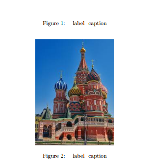

---
## Front matter
lang: ru-RU
title: Computer Skills for Scientific Writing
author: Кодже Лемонго Арман
institute: Российский Университет Дружбы Народов
date: 24 октрябь, 2025, Москва, Россия

## Formatting
mainfont: PT Serif
romanfont: PT Serif
sansfont: PT Sans
monofont: PT Mono
toc: false
slide_level: 2
theme: metropolis
header-includes: 
 - \metroset{progressbar=frametitle,sectionpage=progressbar,numbering=fraction}
 - '\makeatletter'
 - '\beamer@ignorenonframefalse'
 - '\makeatother'
aspectratio: 43
section-titles: true

---

# Цели и задачи

## Цель лабораторной работы

The purpose of this lab work is to learn how to include and manipulate graphics in LaTeX documents using the graphicx package and related tools.

# Выполнение лабораторной работы

## inline and display math mode

```latex
\documentclass{article}
\usepackage{graphicx}

\begin{document}
\begin{figure}[ht]
    \centering
    \includegraphics[width=0.6\textwidth]{image}
    \caption{Моё собственное изображение}
    \label{fig:myimage}
\end{document}
```

{ #fig:001 width=100% }

## Exercise 2: Exploring Size and Rotation Options

```latex
\documentclass{article}
\usepackage{graphicx}

\begin{document}
\includegraphics[height=3cm]{image}
\includegraphics[width=0.3\textwidth]{image}
\includegraphics[scale=0.5]{image}
\includegraphics[angle=45, width=0.2\textwidth]{image}
\end{document}
```

{ #fig:002 width=100% }ults Greek letters}  

## Exercise 3: textbackslash linewidth / Comparing textwidth and linewidth
```latex
\documentclass[twocolumn]{article}
\usepackage{graphicx}
\usepackage{lipsum}

\begin{document}
\lipsum[1]
\begin{figure}[ht]
    \centering
    \includegraphics[width=0.8\textwidth]{image}
    \caption{С использованием \textbackslash textwidth}
\end{figure}
\begin{figure}[ht]
    \centering
    \includegraphics[width=0.8\linewidth]{image}
    \caption{С использованием \textbackslash linewidth}
\end{figure}
\lipsum[2-5]
\end{document}
```

{ #fig:003 width=100% }
## Exercisе 4: Float Placement with Different Specifiers
```latex
\documentclass{article}
\usepackage{graphicx}
\usepackage{lipsum}

\begin{document}
\lipsum[1-2]
\begin{figure}[h]
    \centering
    \includegraphics[width=0.4\textwidth]{image1}
    \caption{Опция h (здесь)}
\end{figure}
\lipsum[3]
\begin{figure}[t]
    \centering
    \includegraphics[width=0.4\textwidth]{image2}
    \caption{Опция t (верх)}
\end{figure}
\begin{figure}[b]
    \centering
    \includegraphics[width=0.4\textwidth]{image3}
    \caption{Опция b (низ)}
\end{figure}
\lipsum[4-8]
\end{document}
```

{ #fig:004 width=100% }

## Exercise 5: Cross-references and Number of Compilations

```latex
\documentclass{article}
\usepackage{graphicx}

\begin{document}
\section{Введение}
\label{sec:intro}

В разделе~\ref{sec:intro} мы представляем...

\subsection{Первая подсекция}
\label{subsec:first}

Как видно в подсекции~\ref{subsec:first}...

\begin{figure}[ht]
    \centering
    \includegraphics[width=0.5\textwidth]{image}
    \caption{Тестовая фигура}
    \label{fig:test}
\end{figure}

Рисунок~\ref{fig:test} показывает...
\end{document}
```

{ #fig:005 width=100% }

## Exercise 6: textbackslash caption / Placing label Before/After caption

```latex
\documentclass{article}
\usepackage{graphicx}

\begin{document}
\begin{figure}[ht]
    \centering
    \includegraphics[width=0.4\textwidth]{image2}
    \label{fig:before}
    \caption{Рисунок с label до caption}
\end{figure}
\begin{figure}[ht]
    \centering
    \includegraphics[width=0.4\textwidth]{image3}
    \caption{Рисунок с label после caption}
    \label{fig:after}
\end{figure}
Ссылка на рисунок~\ref{fig:before} (неправильная)\\
Ссылка на рисунок~\ref{fig:after} (правильная)
\end{document}
```

{ #fig:006 width=100% }

## Exercise 7:  label After end{equation}

```latex
\documentclass{article}
\usepackage{amsmath}

\begin{document}
\begin{equation}
E = mc^2
\end{equation}
\label{eq:after}
\begin{equation}
F = ma
\label{eq:inside}
\end{equation}
Ссылка на уравнение~\ref{eq:after} (неправильная)\\
Ссылка на уравнение~\ref{eq:inside} (правильная)
\end{document}
```

{ #fig:007 width=100% }

# Выводы
в конце нашего лабораторная работа, я освоил  основы включения и управления графикой в документах LaTeX. Освоил работу с пакетом `graphicx`  