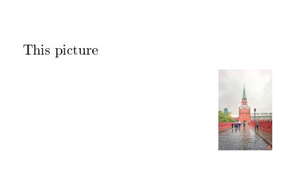
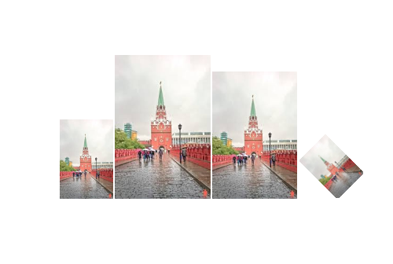
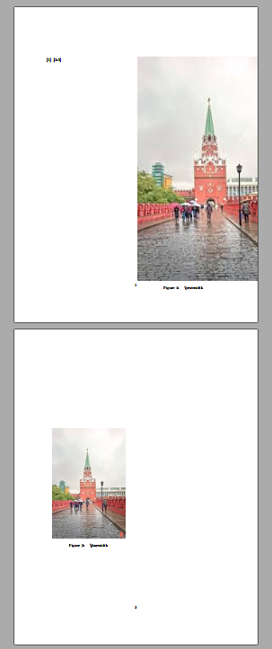
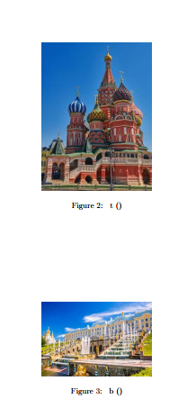
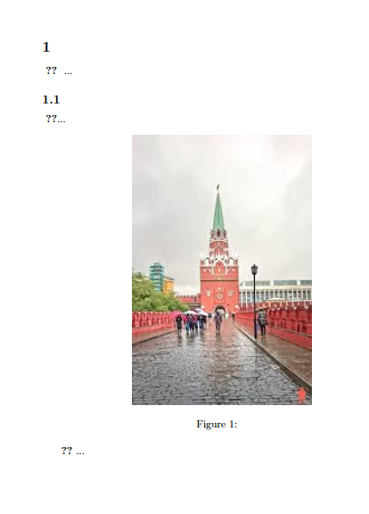
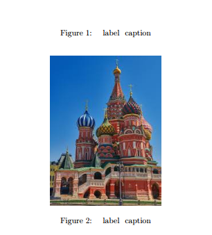
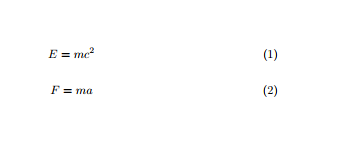

---
# Front matter
title: "Отчёт по лабораторной работе №4"
subtitle: "Computer Skills for Scientific Writing"
author: "Кодже Лемонго Арман"

# Generic otions
lang: ru-RU
toc-title: "Содержание"

# Bibliography
bibliography: bib/cite.bib
csl: pandoc/csl/gost-r-7-0-5-2008-numeric.csl

# Pdf output format
toc: true # Table of contents
toc_depth: 2
lof: true # List of figures
fontsize: 12pt
linestretch: 1.5
papersize: a4
documentclass: scrreprt
## I18n
polyglossia-lang:
  name: russian
  options:
	- spelling=modern
	- babelshorthands=true
polyglossia-otherlangs:
  name: english
### Fonts
mainfont: PT Serif
romanfont: PT Serif
sansfont: PT Sans
monofont: PT Mono
mainfontoptions: Ligatures=TeX
romanfontoptions: Ligatures=TeX
sansfontoptions: Ligatures=TeX,Scale=MatchLowercase
monofontoptions: Scale=MatchLowercase,Scale=0.9
## Biblatex
biblatex: true
biblio-style: "gost-numeric"
biblatexoptions:
  - parentracker=true
  - backend=biber
  - hyperref=auto
  - language=auto
  - autolang=other*
  - citestyle=gost-numeric
## Misc options
indent: true
header-includes:
  - \linepenalty=10 # the penalty added to the badness of each line within a paragraph (no associated penalty node) Increasing the value makes tex try to have fewer lines in the paragraph.
  - \interlinepenalty=0 # value of the penalty (node) added after each line of a paragraph.
  - \hyphenpenalty=50 # the penalty for line breaking at an automatically inserted hyphen
  - \exhyphenpenalty=50 # the penalty for line breaking at an explicit hyphen
  - \binoppenalty=700 # the penalty for breaking a line at a binary operator
  - \relpenalty=500 # the penalty for breaking a line at a relation
  - \clubpenalty=150 # extra penalty for breaking after first line of a paragraph
  - \widowpenalty=150 # extra penalty for breaking before last line of a paragraph
  - \displaywidowpenalty=50 # extra penalty for breaking before last line before a display math
  - \brokenpenalty=100 # extra penalty for page breaking after a hyphenated line
  - \predisplaypenalty=10000 # penalty for breaking before a display
  - \postdisplaypenalty=0 # penalty for breaking after a display
  - \floatingpenalty = 20000 # penalty for splitting an insertion (can only be split footnote in standard LaTeX)
  - \raggedbottom # or \flushbottom
  - \usepackage{float} # keep figures where there are in the text
  - \floatplacement{figure}{H} # keep figures where there are in the text
---

# Цель работы

The purpose of this lab work is to learn how to include and manipulate graphics in LaTeX documents using the graphicx package and related tools.

# Exercises
1. Try including an image you have created, replacing the ‘standard’ ones we have used in the demonstration.
2.  Explore what you can do using the height, width, angle and scale keys.
3. Use the width key to set the size of a graphic relative to \textwidth and another graphic relative to \linewidth. Try out how they behave with or without the twocolumn option.
4. Use lipsum to make a reasonably long demonstration, then try out placing floats using the different position specifiers. How do different specifiers interact?
5. Try adding new numbered parts (sections, subsections, enumerated lists) to the test document and finding out how many runs are needed to make \label commands work
6.  Add some floats and see what happens when you put \label before the \caption instead of after.
7.  What happens if you put a \label for an equation after the \end{equation}?


# Выполнение работы

## 4.10 Exercises

### Exercise 1:  Including Your Own Image

```latex
\documentclass{article}
\usepackage{graphicx}

\begin{document}
\begin{figure}[ht]
    \centering
    \includegraphics[width=0.6\textwidth]{image}
    \caption{Моё собственное изображение}
    \label{fig:myimage}
\end{document}
```

{ #fig:001 width=100% }

### Exercise 2: Exploring Size and Rotation Options

```latex
\documentclass{article}
\usepackage{graphicx}

\begin{document}
\includegraphics[height=3cm]{image}
\includegraphics[width=0.3\textwidth]{image}
\includegraphics[scale=0.5]{image}
\includegraphics[angle=45, width=0.2\textwidth]{image}
\end{document}
```

{ #fig:002 width=100% }

### Exercise 3: textbackslash linewidth / Comparing textwidth and linewidth

```latex
\documentclass[twocolumn]{article}
\usepackage{graphicx}
\usepackage{lipsum}

\begin{document}
\lipsum[1]
\begin{figure}[ht]
    \centering
    \includegraphics[width=0.8\textwidth]{image}
    \caption{С использованием \textbackslash textwidth}
\end{figure}
\begin{figure}[ht]
    \centering
    \includegraphics[width=0.8\linewidth]{image}
    \caption{С использованием \textbackslash linewidth}
\end{figure}
\lipsum[2-5]
\end{document}
```

{ #fig:003 width=100% }

### Exercisе 4: Float Placement with Different Specifiers

```latex
\documentclass{article}
\usepackage{graphicx}
\usepackage{lipsum}

\begin{document}
\lipsum[1-2]
\begin{figure}[h]
    \centering
    \includegraphics[width=0.4\textwidth]{image1}
    \caption{Опция h (здесь)}
\end{figure}
\lipsum[3]
\begin{figure}[t]
    \centering
    \includegraphics[width=0.4\textwidth]{image2}
    \caption{Опция t (верх)}
\end{figure}
\begin{figure}[b]
    \centering
    \includegraphics[width=0.4\textwidth]{image3}
    \caption{Опция b (низ)}
\end{figure}
\lipsum[4-8]
\end{document}
```

{ #fig:004 width=100% }

### Exercise 5: Cross-references and Number of Compilations

```latex
\documentclass{article}
\usepackage{graphicx}

\begin{document}
\section{Введение}
\label{sec:intro}

В разделе~\ref{sec:intro} мы представляем...

\subsection{Первая подсекция}
\label{subsec:first}

Как видно в подсекции~\ref{subsec:first}...

\begin{figure}[ht]
    \centering
    \includegraphics[width=0.5\textwidth]{image}
    \caption{Тестовая фигура}
    \label{fig:test}
\end{figure}

Рисунок~\ref{fig:test} показывает...
\end{document}
```

{ #fig:005 width=100% }

### Exercise 6: textbackslash caption / Placing label Before/After caption

```latex
\documentclass{article}
\usepackage{graphicx}

\begin{document}
\begin{figure}[ht]
    \centering
    \includegraphics[width=0.4\textwidth]{image2}
    \label{fig:before}
    \caption{Рисунок с label до caption}
\end{figure}
\begin{figure}[ht]
    \centering
    \includegraphics[width=0.4\textwidth]{image3}
    \caption{Рисунок с label после caption}
    \label{fig:after}
\end{figure}
Ссылка на рисунок~\ref{fig:before} (неправильная)\\
Ссылка на рисунок~\ref{fig:after} (правильная)
\end{document}
```

{ #fig:006 width=100% }

### Exercise 7:  label After end{equation}

```latex
\documentclass{article}
\usepackage{amsmath}

\begin{document}
\begin{equation}
E = mc^2
\end{equation}
\label{eq:after}
\begin{equation}
F = ma
\label{eq:inside}
\end{equation}
Ссылка на уравнение~\ref{eq:after} (неправильная)\\
Ссылка на уравнение~\ref{eq:inside} (правильная)
\end{document}
```

{ #fig:007 width=100% }


# Выводы

в конце нашего лабораторная работа, я освоил  основы включения и управления графикой в документах LaTeX. Освоил работу с пакетом `graphicx`     


# Список литературы{.unnumbered}

1. [latex](https://www.latex-project.org/get/)
