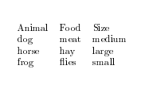
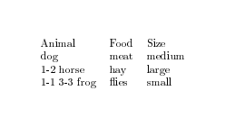
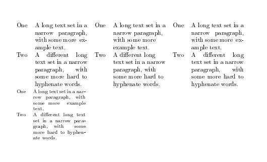

---
## Front matter
lang: ru-RU
title: Computer Skills for Scientific Writing
author: Кодже Лемонго Арман
institute: Российский Университет Дружбы Народов
date: 30 октрябь, 2025, Москва, Россия

## Formatting
mainfont: PT Serif
romanfont: PT Serif
sansfont: PT Sans
monofont: PT Mono
toc: false
slide_level: 2
theme: metropolis
header-includes: 
 - \metroset{progressbar=frametitle,sectionpage=progressbar,numbering=fraction}
 - '\makeatletter'
 - '\beamer@ignorenonframefalse'
 - '\makeatother'
aspectratio: 43
section-titles: true

---

# Цели и задачи

## Цель лабораторной работы

We will assume you load the array package, which adds more functionality to
LaTeX tables, and which is not built into the LaTeX kernel only for historic reasons.
So put the following in your preamble and we’re good to go.

# Выполнение лабораторной работы

## Use the simple table example to start experimenting with tables.

```latex
\documentclass{article}
\usepackage[T1]{fontenc}
\usepackage{array}
\begin{document}
\begin{tabular}{lll}
Animal & Food & Size \\
dog & meat & medium \\
horse & hay & large \\
frog & flies & small \\
\end{tabular}
\end{document}
```

{ #fig:001 width=100% }

## Try out different alignments using the l, c and r column types.

```latex
\documentclass{article}
\usepackage[T1]{fontenc}
\usepackage{array}
\usepackage{booktabs}
\begin{document}
\begin{tabular}{lll}
\toprule
Animal & Food & Size \\
\midrule
dog & meat & medium \\
\cmidrule{1-2}
horse & hay & large \\
\cmidrule{1-1}
\cmidrule{3-3}
frog & flies & small \\
\bottomrule
\end{tabular}
\end{document}
```
{ #fig:002 width=100% }

## What happens if you have too few items in a table row?
If a row in a LaTeX table contains fewer elements than the declared columns, a warning or error occurs during compilation. This is because LaTeX expects exactly the specified number of cells separated by characters. 

This problem is solved either by adding missing empty cells (for example, leaving empty spaces between &), or by adjusting the number of columns in the table declaration.

```latex
\begin{tabular}{l c r}
  Значение 1 & Значение 2 \\ % Ошибка, ожидается 3 элемента
\end{tabular}
```
The problem is there are fewer elements than columns

solution: added an empty cell for the third column
```latex
\begin{tabular}{l c r}
  Значение 1 & Значение 2 &  \\
\end{tabular}
```
## Exercise 5: Cross-references and Number of Compilations

```latex
\documentclass{article}
\usepackage{graphicx}

\begin{document}
\section{Введение}
\label{sec:intro}

В разделе~\ref{sec:intro} мы представляем...

\subsection{Первая подсекция}
\label{subsec:first}

Как видно в подсекции~\ref{subsec:first}...

\begin{figure}[ht]
    \centering
    \includegraphics[width=0.5\textwidth]{image}
    \caption{Тестовая фигура}
    \label{fig:test}
\end{figure}

Рисунок~\ref{fig:test} показывает...
\end{document}
```

{ #fig:005 width=100% }

## How about too many?

If a row in a LaTeX table contains more elements than the declared columns, a compilation error occurs with a message along the following lines: "Extra alignment tab has been changed to \cr" or "You have written too many alignment tabs in a table". This is because LaTeX expects exactly the number of cells in a row that is specified in the table definition (the number of columns), and accordingly exactly the number of & separators (one less than the number of columns).
```latex
\begin{tabular}{c c c}
  1 & 2 & 3 & 4 \\
\end{tabular}
```
Error: 3 columns are declared, but 4 elements in a row

```latex
solution 1: Remove the extra element

```latex
\begin{tabular}{c c c}
  1 & 2 & 3 \\
\end{tabular}
```
solution 2: add a column in the add

```latex
\begin{tabular}{c c c c}
  1 & 2 & 3 & 4 \\
\end{tabular}
```

## Experiment with the \multicolumn command to span across columns

```latex
\documentclass[a4paper]{article}
\usepackage[T1]{fontenc}
\usepackage{array}
\usepackage{ragged2e}
\begin{document}
\begin{table}
\begin{tabular}[t]{lp{3cm}}
One & A long text set in a narrow paragraph, with some more
↪ example text.\\
Two & A different long text set in a narrow paragraph, with
↪ some more hard to hyphenate words.
\end{tabular}%
\begin{tabular}[t]{l>{\raggedright\arraybackslash}p{3cm}}
One & A long text set in a narrow paragraph, with some more
↪ example text.\\
Two & A different long text set in a narrow paragraph, with
↪ some more hard to hyphenate words.
\end{tabular}%
\begin{tabular}[t]{l>{\RaggedRight}p{3cm}}
One & A long text set in a narrow paragraph, with some more
↪ example text.\\
Two & A different long text set in a narrow paragraph, with
↪ some more hard to hyphenate words.
\end{tabular}
\footnotesize
\begin{tabular}[t]{lp{3cm}}
One & A long text set in a narrow paragraph, with some more
↪ example text.\\
Two & A different long text set in a narrow paragraph, with
↪ some more hard to hyphenate words.
\end{tabular}
\end{table}
\end{document}
```

{ #fig:005 width=100% }

# Выводы
в конце нашего лабораторная работа, я освоил  основы включения и управления Tables в документах LaTeX.   