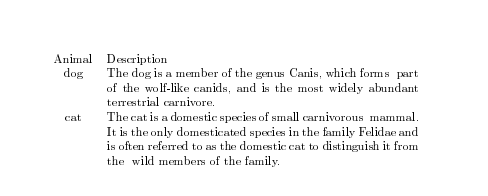
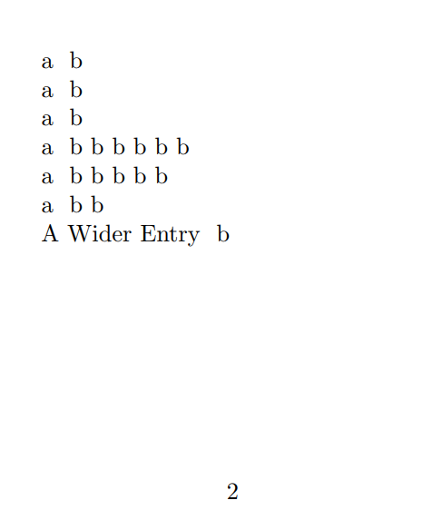

---
# Front matter
title: "Отчёт по лабораторной работе №5"
subtitle: "Computer Skills for Scientific Writing"
author: "Кодже Лемонго Арман"

# Generic otions
lang: ru-RU
toc-title: "Содержание"

# Bibliography
bibliography: bib/cite.bib
csl: pandoc/csl/gost-r-7-0-5-2008-numeric.csl

# Pdf output format
toc: true # Table of contents
toc_depth: 2
lof: true # List of figures
fontsize: 12pt
linestretch: 1.5
papersize: a4
documentclass: scrreprt
## I18n
polyglossia-lang:
  name: russian
  options:
	- spelling=modern
	- babelshorthands=true
polyglossia-otherlangs:
  name: english
### Fonts
mainfont: PT Serif
romanfont: PT Serif
sansfont: PT Sans
monofont: PT Mono
mainfontoptions: Ligatures=TeX
romanfontoptions: Ligatures=TeX
sansfontoptions: Ligatures=TeX,Scale=MatchLowercase
monofontoptions: Scale=MatchLowercase,Scale=0.9
## Biblatex
biblatex: true
biblio-style: "gost-numeric"
biblatexoptions:
  - parentracker=true
  - backend=biber
  - hyperref=auto
  - language=auto
  - autolang=other*
  - citestyle=gost-numeric
## Misc options
indent: true
header-includes:
  - \linepenalty=10 # the penalty added to the badness of each line within a paragraph (no associated penalty node) Increasing the value makes tex try to have fewer lines in the paragraph.
  - \interlinepenalty=0 # value of the penalty (node) added after each line of a paragraph.
  - \hyphenpenalty=50 # the penalty for line breaking at an automatically inserted hyphen
  - \exhyphenpenalty=50 # the penalty for line breaking at an explicit hyphen
  - \binoppenalty=700 # the penalty for breaking a line at a binary operator
  - \relpenalty=500 # the penalty for breaking a line at a relation
  - \clubpenalty=150 # extra penalty for breaking after first line of a paragraph
  - \widowpenalty=150 # extra penalty for breaking before last line of a paragraph
  - \displaywidowpenalty=50 # extra penalty for breaking before last line before a display math
  - \brokenpenalty=100 # extra penalty for page breaking after a hyphenated line
  - \predisplaypenalty=10000 # penalty for breaking before a display
  - \postdisplaypenalty=0 # penalty for breaking after a display
  - \floatingpenalty = 20000 # penalty for splitting an insertion (can only be split footnote in standard LaTeX)
  - \raggedbottom # or \flushbottom
  - \usepackage{float} # keep figures where there are in the text
  - \floatplacement{figure}{H} # keep figures where there are in the text
---

# Цель работы

We will assume you load the array package, which adds more functionality to
LaTeX tables, and which is not built into the LaTeX kernel only for historic reasons.
So put the following in your preamble and we’re good to go.

# Exercises
1. Use the simple table example to start experimenting with tables.
2. Try out different alignments using the l, c and r column types.
3. What happens if you have too few items in a table row?
4. How about too many?
5. Experiment with the \multicolumn command to span across columns


# Выполнение работы

## Exercises

### Use the simple table example to start experimenting with tables.

```latex
\documentclass{article}
\usepackage[T1]{fontenc}
\usepackage{array}
\begin{document}
\begin{tabular}{lll}
Animal & Food & Size \\
dog & meat & medium \\
horse & hay & large \\
frog & flies & small \\
\end{tabular}
\end{document}
```

{ #fig:001 width=100% }

```latex
\documentclass{article}
\usepackage[T1]{fontenc}
\usepackage{array}
\begin{document}
\begin{tabular}{cp{9cm}}
Animal & Description \\
dog & The dog is a member of the genus Canis, which forms
↪ part of the
wolf-like canids, and is the most widely abundant
↪ terrestrial
carnivore. \\
cat & The cat is a domestic species of small carnivorous
↪ mammal. It is the
only domesticated species in the family Felidae and
↪ is often referred
to as the domestic cat to distinguish it from the
↪ wild members of the
family. \\
\end{tabular}
\end{document}
```
{ #fig:001 width=100% }

### Try out different alignments using the l, c and r column types.
```latex
\documentclass{article}
\usepackage[T1]{fontenc}
\usepackage{array}
\usepackage{booktabs}
\begin{document}
\begin{tabular}{lll}
\toprule
Animal & Food & Size \\
\midrule
dog & meat & medium \\
\cmidrule{1-2}
horse & hay & large \\
\cmidrule{1-1}
\cmidrule{3-3}
frog & flies & small \\
\bottomrule
\end{tabular}
\end{document}
```
{ #fig:002 width=100% }

```latex
\documentclass{article}
\usepackage[paperheight=8cm,paperwidth=8cm]{geometry}
\usepackage{array}
\usepackage{longtable}
\begin{document}
\begin{longtable*}{cc}
\multicolumn{2}{c}{A Long Table}\\
Left Side & Right Side\\
\hline
\endhead
\hline
\endfoot
aa & bb\\
Entry & b\\
a & b\\
a & b\\
a & b\\
a & b\\
a & bbb\\
a & b\\
a & b\\
a & b\\
a & b\\
a & b\\
a & b\\
a & b b b b b b\\
a & b b b b b\\
a & b b\\
A Wider Entry & b\\
\end{longtable*}
\end{document}
```
{ #fig:002 width=100% }

### What happens if you have too few items in a table row?
If a row in a LaTeX table contains fewer elements than the declared columns, a warning or error occurs during compilation. This is because LaTeX expects exactly the specified number of cells separated by characters. 

This problem is solved either by adding missing empty cells (for example, leaving empty spaces between &), or by adjusting the number of columns in the table declaration.

```latex
\begin{tabular}{l c r}
  Значение 1 & Значение 2 \\ % Ошибка, ожидается 3 элемента
\end{tabular}
```
The problem is there are fewer elements than columns

solution: added an empty cell for the third column
```latex
\begin{tabular}{l c r}
  Значение 1 & Значение 2 &  \\
\end{tabular}
```

### How about too many?

If a row in a LaTeX table contains more elements than the declared columns, a compilation error occurs with a message along the following lines: "Extra alignment tab has been changed to \cr" or "You have written too many alignment tabs in a table". This is because LaTeX expects exactly the number of cells in a row that is specified in the table definition (the number of columns), and accordingly exactly the number of & separators (one less than the number of columns).
```latex
\begin{tabular}{c c c}
  1 & 2 & 3 & 4 \\
\end{tabular}
```
Error: 3 columns are declared, but 4 elements in a row

```latex
solution 1: Remove the extra element

```latex
\begin{tabular}{c c c}
  1 & 2 & 3 \\
\end{tabular}
```
solution 2: add a column in the add

```latex
\begin{tabular}{c c c c}
  1 & 2 & 3 & 4 \\
\end{tabular}
```
### Experiment with the \multicolumn command to span across columns
```latex
\documentclass[a4paper]{article}
\usepackage[T1]{fontenc}
\usepackage{array}
\usepackage{ragged2e}
\begin{document}
\begin{table}
\begin{tabular}[t]{lp{3cm}}
One & A long text set in a narrow paragraph, with some more
↪ example text.\\
Two & A different long text set in a narrow paragraph, with
↪ some more hard to hyphenate words.
\end{tabular}%
\begin{tabular}[t]{l>{\raggedright\arraybackslash}p{3cm}}
One & A long text set in a narrow paragraph, with some more
↪ example text.\\
Two & A different long text set in a narrow paragraph, with
↪ some more hard to hyphenate words.
\end{tabular}%
\begin{tabular}[t]{l>{\RaggedRight}p{3cm}}
One & A long text set in a narrow paragraph, with some more
↪ example text.\\
Two & A different long text set in a narrow paragraph, with
↪ some more hard to hyphenate words.
\end{tabular}
\footnotesize
\begin{tabular}[t]{lp{3cm}}
One & A long text set in a narrow paragraph, with some more
↪ example text.\\
Two & A different long text set in a narrow paragraph, with
↪ some more hard to hyphenate words.
\end{tabular}
\end{table}
\end{document}
```

{ #fig:005 width=100% }

# Выводы

в конце нашего лабораторная работа, я освоил  основы включения и управления Tables в документах LaTeX.    


# Список литературы{.unnumbered}

1. [latex](https://www.latex-project.org/get/)
