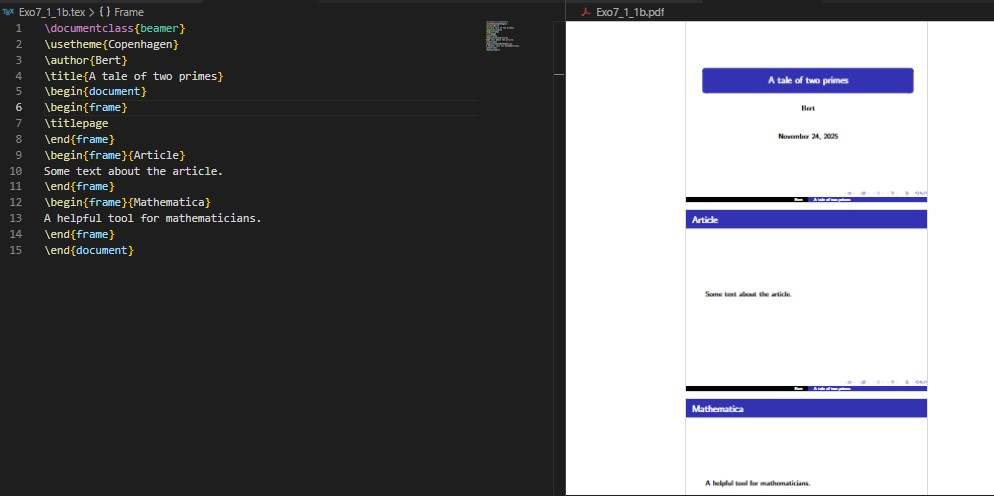
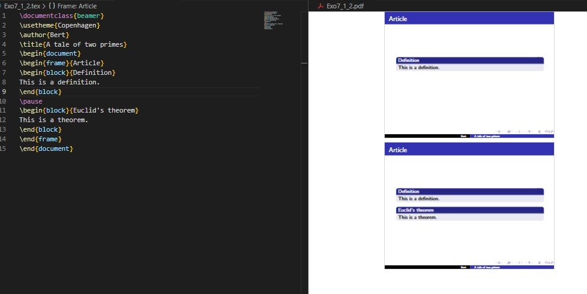
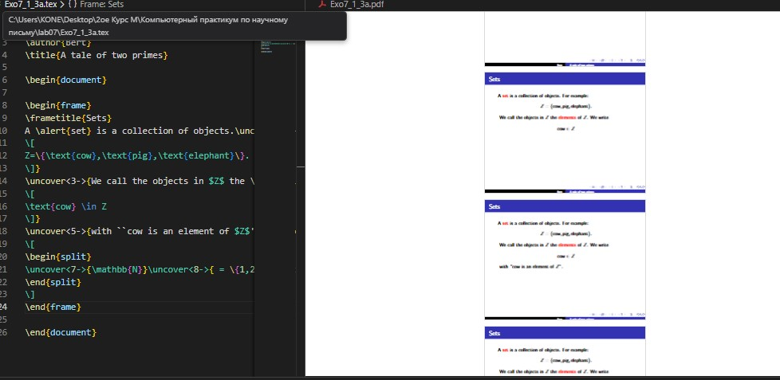
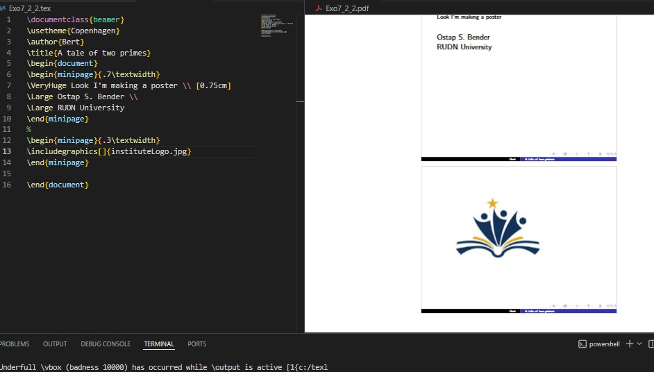
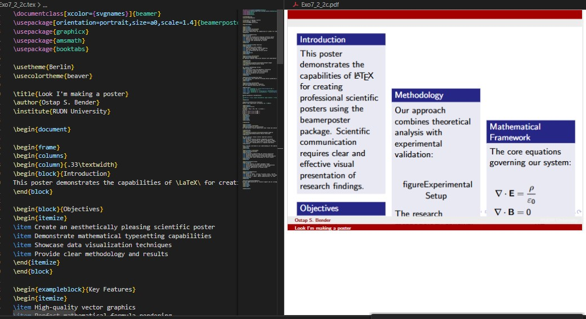
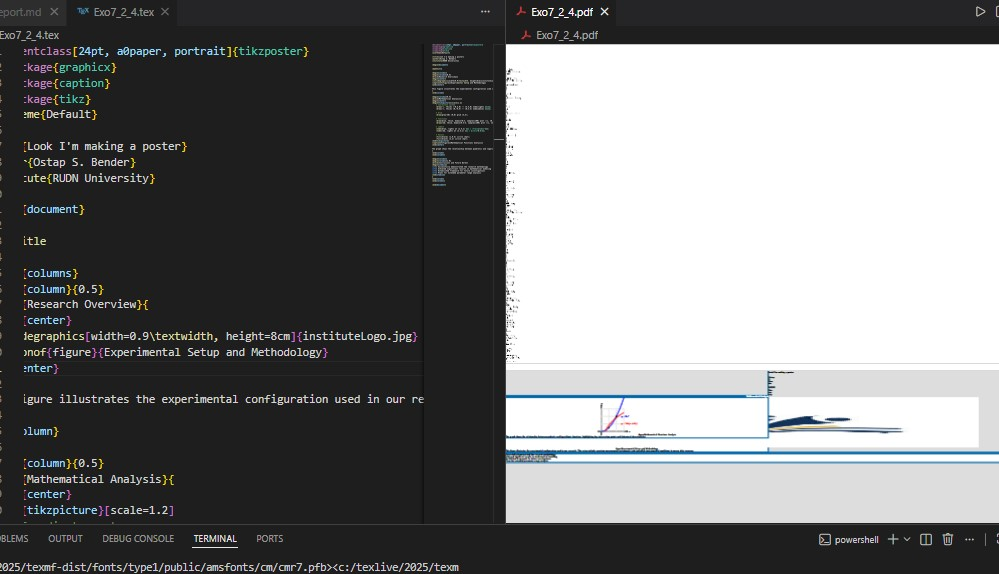
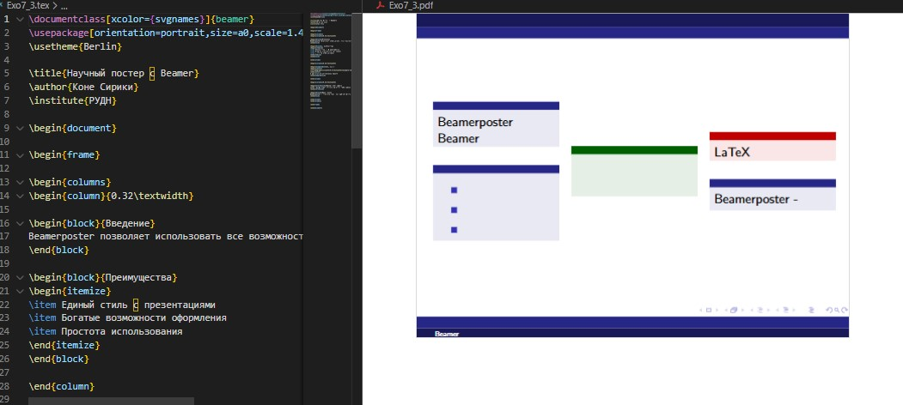
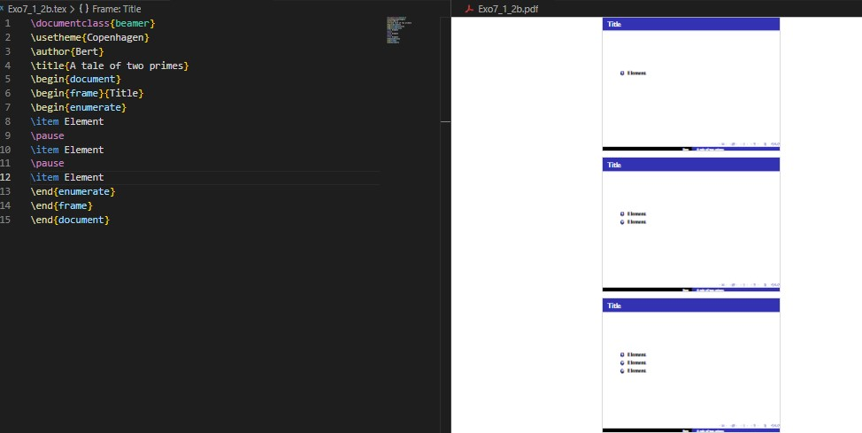

---
## Front matter
lang: ru-RU
title: Презентация лабораторной работе №7  
subtitle: LaTeX Presentations and Posters
author:
  - Кодже лемонго Арман
institute:
  - Российский университет дружбы народов, Москва, Россия
  - Объединённый институт ядерных исследований, Дубна, Россия

## i18n babel
babel-lang: russian
babel-otherlangs: english

## Formatting pdf
toc: false
toc-title: Содержание
slide_level: 2
aspectratio: 169
section-titles: true
theme: metropolis
header-includes:
 - \metroset{progressbar=frametitle,sectionpage=progressbar,numbering=fraction}
---

# Информация

## Докладчик

:::::::::::::: {.columns align=center}
::: {.column width="70%"}

  * Кодже лемонго Арман
  * Студент НФИ-мд-01-24
  * Российский университет дружбы народов

:::
::::::::::::::

## Цель работы

Целью данной лабораторной работы является освоение создания презентаций и постеров в LaTeX с использованием пакета Beamer и других инструментов для визуального представления научных работ.

# Теоретическое введение

## 7 Презентации LaTeX 

Для создания презентаций в LaTeX используется класс документов beamer.

## 7.1 Презентации с Beamer 

Beamer предоставляет профессиональные темы и возможности анимации.

{width=80%}

## Структура презентации 

Основные элементы: титульный слайд, frame окружения, блоки и колонки.

{width=80%}

## Паузы и эффекты 

Команды `\pause` и `\uncover` для динамического появления контента.

:::::::::::::: {.columns align=center}
::: {.column width="50%"}

**Паузы с**
{width=90%}

:::
::: {.column width="50%"}

**Точное управление с**
{width=90%}

:::
::::::::::::::

## 7.2 Постеры 

Три основных метода создания постеров в LaTeX.
Three main methods for creating posters in LaTeX.

## Методы создания постеров

:::::::::::::: {.columns align=center}
::: {.column width="33%"}

**a0poster**
{width=90%}

:::
::: {.column width="33%"}

**beamerposter**
{width=90%}

:::
::: {.column width="33%"}

**tikzposter**
{width=90%}

:::
::::::::::::::

# Выполнение лабораторной работы

## Создание постеров

:::::::::::::: {.columns align=center}
::: {.column width="50%"}

**Постер с a0poster**
{width=90%}

:::
::: {.column width="50%"}

**Постер с beamerposter**
{width=90%}

:::
::::::::::::::

# Выводы

В ходе лабораторной работы №7 я освоил создание презентаций и постеров в LaTeX. Изучил работу с классом Beamer для создания динамических презентаций с паузами и эффектами появления. Освоил три основных метода создания постеров: a0poster, beamerposter и tikzposter, изучил их преимущества и особенности применения.

# Список литературы

1. [latex](https://www.latex-project.org/get/)