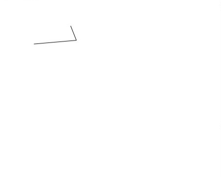
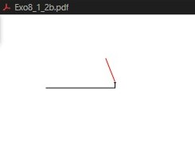
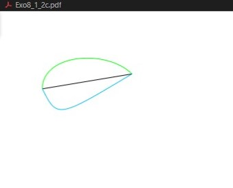
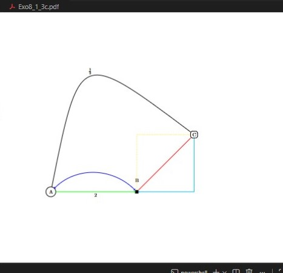
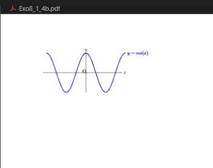
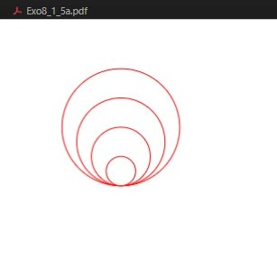
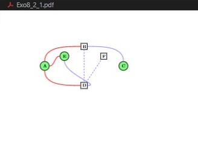
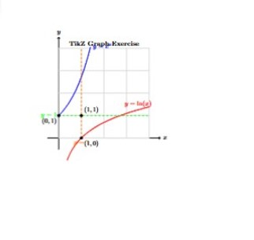
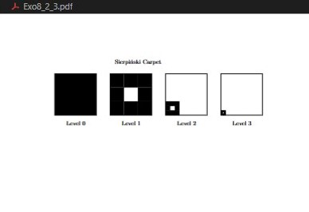
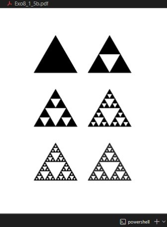

---
## Front matter
lang: ru-RU
title: Презентация лабораторной работе №8  
subtitle: Diagrams and Drawings as Code
author:
  - Кодже лемонго Арман
institute:
  - Российский университет дружбы народов, Москва, Россия
  - Объединённый институт ядерных исследований, Дубна, Россия

## i18n babel
babel-lang: russian
babel-otherlangs: english

## Formatting pdf
toc: false
toc-title: Содержание
slide_level: 2
aspectratio: 169
section-titles: true
theme: metropolis
header-includes:
 - \metroset{progressbar=frametitle,sectionpage=progressbar,numbering=fraction}
---

# Информация

## Докладчик

:::::::::::::: {.columns align=center}
::: {.column width="70%"}

  * Кодже лемонго Арман
  * Студент НФИ-мд-01-24
  * Российский университет дружбы народов

:::
::::::::::::::

## Цель работы

Целью данной лабораторной работы является освоение создания диаграмм и рисунков программным способом в LaTeX с использованием пакета TikZ и других инструментов для визуального представления данных и математических объектов.

## Задание

1. Изучить основы создания графики с помощью пакета TikZ
2. Освоить построение линий, кривых и узлов в TikZ
3. Научиться создавать сложные графики и диаграммы

# Теоретическое введение

## 8 Диаграммы и рисунки как код 

TikZ - мощный пакет для создания графики программным способом в LaTeX.

## 8.1 TikZ - Основы 

Основные элементы: линии, узлы, кривые и системы координат.

{width=80%}

## Строительные блоки TikZ 

:::::::::::::: {.columns align=center}
::: {.column width="50%"}

**Рисование линий**
{width=90%}

:::
::: {.column width="50%"}

**Узлы и метки**
{width=90%}

:::
::::::::::::::

## Возможности TikZ 

:::::::::::::: {.columns align=center}
::: {.column width="33%"}

**Графики функций**
{width=90%}

:::
::: {.column width="33%"}

**Циклы и повторения**
{width=90%}

:::
::: {.column width="33%"}

**Стили и цвета**
{width=90%}

:::
::::::::::::::

# Выполнение лабораторной работы

## Упражнение 1: Создание графа 

**Ориентированный граф с узлами и связями**
{width=80%}

## Упражнение 2: Графики функций 

:::::::::::::: {.columns align=center}
::: {.column width="60%"}

**Экспонента и логарифм**
{width=95%}

:::
::: {.column width="40%"}

**Функции:**
- $y = e^x$
- $y = \ln(x)$  
- $y = 1$
- $x = 1$

**Особенности:**
- Система координат
- Сетка
- Метки точек

:::
::::::::::::::

## Упражнение 3: Фракталы 

:::::::::::::: {.columns align=center}
::: {.column width="50%"}

**Ковёр Серпинского**
{width=90%}

:::
::: {.column width="50%"}

**Треугольник Серпинского**
{width=90%}

:::
::::::::::::::

# Выводы

В ходе лабораторной работы №8 я освоил создание диаграмм и рисунков программным способом в LaTeX с использованием пакета TikZ. Изучил основы построения линий, кривых и узлов, освоил создание сложных графиков функций и фрактальных структур.

# Список литературы

1. [latex](https://www.latex-project.org/get/)